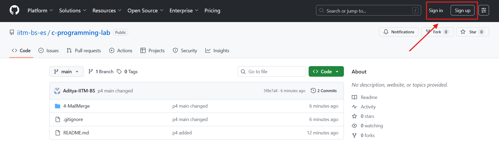

# IITM-C-Programming-Lab

## Instructions:

- Login to Github using student email

- Click Code button

- Click on Codespaces tab (only available when logged in), Click on `Create codespace on main`

- A VSCode like interface will open where you will do all the lab questions


## VSCode Interface

When the Codespace opens, you will see an editor that looks like Visual Studio Code.  
Here are the main parts you should know:

1. **Activity Bar (Left Sidebar)**  
   - Contains icons for **Explorer (files)**, **Search**, **Source Control (Git)**, **Run/Debug**, and **Extensions**.  
   - You will mostly use the **Explorer** to open your lab files.

   <!--  -->

2. **Explorer Panel**  
   - Shows all the files and folders in your lab repository.  
   - Click on a folder (e.g., `1-debug`) to show the contents of that folder.
   - Click on a file (e.g., `prime.c`) to open it in the editor.
   - If you don't see the Explorer panel, click on the Explorer tab in Activity Bar.

   <!--  -->

3. **Editor Area (Center)**  
   - This is where your code files open.  
   - You can open multiple files in tabs, similar to a browser.

   <!--  -->

4. **Terminal (Bottom Panel)**  
   - Use this to compile and run your C programs.  
   - Open/close it by clicking **View > Terminal** or pressing <kbd>Ctrl</kbd> + <kbd>`</kbd> (backtick).  

   Example commands:
   ```bash
   gcc lab1.c -o lab1
   ./lab1

## Basics of Terminal Navigation

The **terminal** is where you type commands to interact with the computer.  
Don’t worry if this is new — here are the basics you’ll need for your lab:

1. **Check where you are (current folder)**

```bash
   pwd
```

Example output:

```
/workspaces/IITM-C-Programming-Lab
```

2. **See what files are in the current folder**

   ```bash
   ls
   ```

   Example output:

   ```
   lab1.c  lab2.c  helpers.h
   ```

3. **Move into a folder**

   ```bash
   cd foldername
   ```

   Example:

   ```bash
   cd Lab1
   ```

4. **Move back one step**

   ```bash
   cd ..
   ```

5. **Clear the terminal screen**

   ```bash
   clear
   ```


### Running your C program

Once you are inside the folder with your `.c` file:

1. **Compile the code**

   ```bash
   gcc lab1.c -o lab1
   ```

   * `gcc` is the compiler.
   * `lab1.c` is your source file.
   * `-o lab1` means “create an output file called `lab1`”.

2. **Run the program**

   ```bash
   ./lab1
   ```

